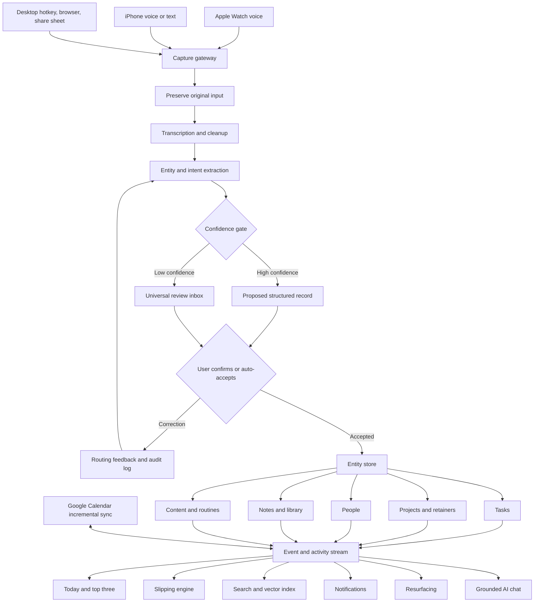

# Commercial Viability, Product Strategy, Competitive Landscape, and Naming Research for an AI Personal Operations App

## Executive summary

**Verdict: worth building only with a narrow initial wedge.** The concept is commercially promising because it addresses a proven and persistent problem: people already use task managers, calendars, note systems, habit trackers, project-management tools, read-it-later products, and personal CRMs, yet information capture and cross-tool fragmentation remain painful. Notion reported more than 100 million users in 2024, Todoist currently claims more than 30 million users, and ClickUp reported more than 20 million users and $300 million in annual recurring revenue in 2025. These figures demonstrate substantial willingness to adopt productivity software, although their user counts overlap and should not be added together as a market-size estimate. citeturn23view0turn23view1turn23view2

The transcript describes more than a task manager. It is an **AI-assisted personal operating system** that converts unstructured inputs into structured records, then uses those records to plan work, identify neglected commitments, preserve personal knowledge, and answer questions. Its defining ideas are low-friction Apple Watch, phone, and desktop capture; AI cleanup and routing; a unified Today screen; a “slipping” engine; first-class support for both finite projects and ongoing retainers; and one contextual data layer spanning tasks, projects, content, people, routines, and personal knowledge. fileciteturn0file0

However, the horizontal proposition—“one app for tasks, calendar, notes, projects, contacts, and AI”—is no longer an open market. Routine is now an especially close competitor: it combines tasks, calendars, notes, projects, a universal inbox, desktop quick capture, voice commands, custom databases, global search, contacts, cross-platform synchronization, and an AI assistant. It says it is used by more than 100,000 professionals and teams, and currently charges from free to $10 per month for individuals. citeturn17view0turn17view1 Tana, Notion, ClickUp, Motion, Capacities, Akiflow, Sunsama, Todoist, Twos, and others cover substantial portions of the same territory. Recent launches such as GetThis, Hello Aria, GAIA, Martin, and Routine AI also show that voice-first AI productivity is attracting new entrants. citeturn0search0turn0search6turn0search2turn0search3turn7search10

The concept therefore has a **conditional commercial score of approximately 7/10**:

| Factor | Assessment | Implication |
|---|---:|---|
| Problem intensity | 8/10 | Capture friction and tool fragmentation are real and frequent |
| Category demand | 9/10 | Millions already use and pay for related products |
| Competitive intensity | 9/10 | Direct and adjacent alternatives are numerous |
| Differentiation as currently described | 5/10 | The broad feature bundle is increasingly reproducible |
| Differentiation with a focused wedge | 8/10 | Retainers, creator workflows, and object-level “slipping” remain promising |
| Technical feasibility | 7/10 | Feasible, but reliable sync, classification, and privacy are harder than the UI |
| Monetization potential | 7/10 | Prosumer subscriptions work, but willingness to switch is the challenge |

The strongest initial positioning is:

> **The voice-first command center for independent professionals who manage recurring clients, content, and personal commitments. Capture anything in seconds; it files itself; nothing quietly goes stale.**

That positioning is stronger than “a productivity app for your whole life.” It directly serves creator-consultants, solo agency owners, fractional executives, freelancers with retainers, and other people whose work spans clients, recurring obligations, content production, relationships, and personal administration.

The product should launch **iPhone, Apple Watch, and responsive web first**, not attempt every platform simultaneously. Apple supports shortcuts and App Intents through Siri, Spotlight, the Shortcuts app, the Action button, and Apple Watch, while Home Screen web apps support web push on current iOS versions. This combination makes an Apple-first capture wedge technically credible without requiring every interface to be fully native at launch. citeturn11search17turn11search18

The recommended business model is **freemium plus recurring subscriptions**, with an initial paid price around **$12–$15 per month**, an advanced creator/consultant tier around **$24–$29 per month**, and team or agency functionality later. A one-time-purchase model is poorly matched to recurring expenses for transcription, language models, embeddings, storage, calendar synchronization, notifications, and support. Competitors reinforce this price range: Routine charges $5 and $10 per month for individual tiers, Tana charges $8 and $14, Motion begins around $19 per seat per month, Sunsama charges $17 per month when billed annually, and Akiflow charges approximately $19 per month on its annual plan. citeturn17view1turn10search10turn2search1turn2search4turn2search0

The leading preliminary name is **LifeRelay**. It communicates the product mechanism: a thought enters once, is relayed to the correct object, and returns when relevant. **RecallLoop** and **Slipwell** are the other two recommended finalists. No obvious exact-match indexed conflict surfaced for those three during the initial knockout search, but that is not domain availability or legal trademark clearance.

## Product definition and MVP scope

The product should be treated as an **event-driven personal information system**, not as a collection of disconnected mini-apps. Every voice note, typed entry, imported calendar event, contact interaction, completed routine, project update, and content milestone should become part of a shared event and entity model.

The core product loop is:

**Capture → interpret → confirm → structure → surface → act → learn.**

The important distinction is that AI should not merely summarize text. It should propose an object type, title, date, domain, project, person, reminder, and next action while preserving the original input and making every automated decision reversible.

| Product area | Full product requirement | MVP decision | Key acceptance target |
|---|---|---|---|
| Universal capture | Voice and text from Watch, phone, browser, desktop shortcut, share sheet, and widgets | **Include:** iPhone, Apple Watch Shortcut/App Intent, web capture, desktop hotkey | Median capture-to-confirmation below 8 seconds |
| AI interpretation | Remove filler words, transcribe, infer object type, extract dates, reminders, people, projects, and domains | **Include:** task, note, person update, and project update | At least 85% of proposed classifications accepted without structural correction |
| Review and trust | Show where each capture went, confidence, original text, undo, edit, and routing history | **Include and make prominent** | Fewer than 1% unrecoverable capture failures |
| Today view | Top-three priorities, calendar, due tasks, routine summary, slipping items, recent captures | **Include:** top three, calendar, due/open tasks, slipping, capture review | Majority of retained users open Today at least three days per week |
| Calendar | Google Calendar read synchronization, event context, optional task time blocking | **Include:** read sync initially; write/time blocking later | Incremental sync with clear last-sync status |
| Tasks | Natural-language dates, priorities, reminders, recurrence, links to projects/content/people | **Include** | Creation, rescheduling, completion, and recurrence must work offline-tolerantly |
| Projects | Finite projects with milestones, templates, checklists, tasks, activity, and optional time logging | **Include simplified version** | New templated project created in under two minutes |
| Retainers | Recurring monthly commitments, resettable checklists, preserved overdue items, recurring deliverables | **Include; this is part of the wedge** | Monthly roll-forward occurs without duplicating or losing unfinished work |
| Slipping engine | Detect stale tasks, projects, retainers, content, and relationships based on expected cadence | **Include; this is the signature feature** | Users act on at least 25% of surfaced slipping items |
| Search | Keyword, filters, entity relationships, backlinks, and semantic retrieval | **Include keyword/global search; semantic later in beta** | Relevant known item found in fewer than three interactions |
| Notifications | Due reminders, routine reminders, slipping alerts, summaries, and capture confirmations | **Include selectively** | Granular controls and quiet-hours support |
| Routines and streaks | Separate habits from actionable tasks; morning, afternoon, evening, fixed-duration challenges | **Defer full streak analytics to post-MVP** | MVP may show a simple routine checklist |
| Content pipeline | Idea, research, outline, production, editing, scheduled, published, promoted | **Launch as an opinionated project template** | Avoid a separate content database until demand is verified |
| Personal CRM | People, facts, interactions, dates, follow-ups, relationship cadence | **Include lightweight people records and links** | Full CRM views and contact sync after MVP |
| Personal library | Notes, journal, highlights, quotes, books, media, tags, sources, resurfacing | **Include notes; defer books, Kindle, photo journal, and rich resurfacing** | Import/export must be available before broad launch |
| AI chat | Answers across user data with citations to source records | **Beta after data model and retrieval quality are stable** | Every answer links to supporting records and admits insufficient evidence |
| Collaboration | Shared spaces, assignments, permissions, guest access | **Exclude from first release** | Consider only after individual retention is proven |
| Inventory | Personal possessions, images, insurance records, depreciation/disposal prompts | **Exclude** | It is unrelated to the initial commercial wedge |
| Custom database builder | Arbitrary user-created objects, fields, and views | **Exclude initially** | Premature flexibility would recreate Notion-like setup friction |

The first release should therefore be substantially smaller than the transcript’s application. Its product promise should be fulfilled through approximately six visible surfaces:

1. Capture and review.
2. Today.
3. Tasks.
4. Projects and retainers.
5. People and notes.
6. Search and settings.

Routines, content, and resurfacing can initially be specialized views or templates on top of the same entity model. This avoids creating independent modules that later become difficult to reconcile.

The “slipping” feature should be more sophisticated than an overdue list. Each entity should have an expected attention cadence:

| Entity | Example slipping rule |
|---|---|
| One-time project | No task completed, activity logged, or milestone changed for seven days |
| Monthly retainer | Required deliverable not started by its expected point in the cycle |
| Content item | Remains in one pipeline stage longer than its normal stage duration |
| Person | No interaction or follow-up within the user-defined relationship cadence |
| Note marked for review | Review date passed without acknowledgement |
| Task without a due date | No edit, defer, schedule, or completion action for a configurable interval |

This produces a defensible **attention-risk engine**. Over time, the engine can learn different expected cadences for different clients, projects, content types, and relationships. Competitors often show due dates and overdue work; fewer make cross-object staleness a central, opinionated product concept.



A Node.js or Next.js service with Supabase is suitable for an MVP, provided the architecture is more rigorous than a simple browser application connected directly to tables. Supabase provides Postgres, authentication, file storage, realtime features, and vector support, but exposed tables need row-level security, and service-role credentials must never be shipped to clients. citeturn11search0turn11search2turn11search12turn11search19

The recommended architecture is:

| Layer | Recommended implementation |
|---|---|
| Capture clients | Native iOS/watchOS capture extension or App Intent; responsive web/PWA; lightweight desktop helper |
| API | Node.js/TypeScript or Next.js server routes with schema validation |
| Database | Supabase Postgres with strict row-level security and tenant-scoped records |
| Files | Supabase Storage with signed URLs and per-user policies |
| Search | Postgres full-text search plus pgvector for semantic retrieval |
| Background work | Durable job queue for transcription, embeddings, reminders, sync, and resurfacing |
| Calendar | Google OAuth, incremental sync tokens, push notifications, and reconciliation jobs |
| Auditability | Append-only event log for AI proposals, edits, confirmations, and deletions |
| AI | Provider abstraction, structured JSON outputs, confidence scoring, source-linked retrieval |
| Reliability | Idempotent capture endpoints, retry queue, dead-letter handling, offline local queue |
| Portability | Markdown, CSV, JSON, and media export; documented deletion and retention controls |

Google recommends push notifications rather than repeated polling for Calendar changes and supports incremental synchronization through sync tokens. Those mechanisms should be used from the beginning because unreliable or duplicated calendar data will immediately damage user trust. citeturn11search3turn11search15

## Competitive landscape

The category contains four overlapping competitor groups:

| Group | Representative products | What they validate |
|---|---|---|
| Unified personal workspaces | Routine, Tana, Capacities, Notion, Twos | Demand for tasks, notes, structured data, and AI in one place |
| Daily planning and scheduling | Motion, Sunsama, Akiflow, NotePlan | Willingness to pay for focus, calendar integration, and planning |
| Task and project platforms | Todoist, ClickUp | Large-scale demand for dependable task and project execution |
| Personal knowledge and memory | Readwise, mymind, Amplenote, personal CRM products | Demand for capture, retrieval, highlights, resurfacing, and relationships |

### Competitor comparison

Prices below are public list prices observed during the research period and may vary by billing term, tax, region, or future product changes.

| Product | Current public pricing | Platforms | Major overlap | Traction proxy | Important opening for the proposed product |
|---|---|---|---|---|---|
| **Routine** | Free; Personal $5/month; Professional $10/month; Business $15/seat/month | Web, macOS, Windows, Linux, iOS, Android | Voice capture, tasks, calendar, projects, notes, contacts, databases, search, AI | Claims 100,000+ professionals and teams; 1,400+ Product Hunt followers | Closest direct competitor. Retainers, creator workflows, habit separation, and a native cross-object slipping model are not central documented propositions. citeturn17view0turn17view1turn17view2 |
| **Tana** | Free; Plus about $8/month; Pro about $14/month | Desktop/web and mobile apps | Voice transcription, AI, structured knowledge graph, tasks, calendar | Approximately 3,400 Product Hunt followers and a sizable community | Powerful but requires learning its graph/supertag model; the opening is opinionated workflows with less configuration. citeturn10search10turn23view4 |
| **Notion** | Free; Plus approximately $10/user/month; Business approximately $20/user/month | Web, desktop, iOS, Android | Notes, databases, projects, content pipelines, CRM templates, AI | Passed 100 million users in August 2024 | Nearly anything can be built, but setup and ongoing database maintenance recreate the friction identified in the transcript. citeturn23view0turn17view5 |
| **ClickUp** | Free; Unlimited about $7/user/month annually; Business about $12; AI offerings extra | Web, desktop, iOS, Android | Tasks, projects, docs, calendar, dashboards, time tracking, AI | More than 20 million users and reported $300 million ARR in 2025 | Strong for teams but frequently perceived as feature-dense; personal relationships, journaling, and low-friction whole-life capture are not its core. citeturn17view6turn23view2turn0search1 |
| **Motion** | Pro AI about $19/seat/month; Business AI about $29 | Web/desktop, iOS, Android | AI scheduling, calendar, tasks, projects, docs, assistant | Private company; no dependable current user count located | Optimizes schedules well, but provides less depth in personal knowledge, relationship memory, habits, and content history. citeturn17view4 |
| **Sunsama** | About $17/month annually or $22 month-to-month | Web, desktop, iOS, Android | Guided daily planning, calendar, task integrations | Established premium daily-planning product | Deliberate planning rather than AI auto-filing; limited personal CRM and knowledge-memory proposition. citeturn2search4 |
| **Akiflow** | Approximately $19/month annually or $34 monthly | Desktop, web, mobile | Universal task inbox, calendar, time blocking, AI assistant | Says it serves more than 10,000 professionals and teams | Strong planning, but weaker as a journal, personal CRM, content system, and long-term memory layer. citeturn2search0 |
| **Todoist** | Free; Pro approximately $5/month annually; Business approximately $8 | Web, desktop, iOS, Android, wearables | Rapid natural-language task capture, reminders, recurrence, calendar, voice “Ramble” | More than 30 million users and 337,000+ five-star reviews claimed | High reliability and low complexity, but deliberately narrower than a personal operating system. citeturn23view1turn5search9 |
| **Capacities** | Free; Pro approximately $9.99/month annually | Web/desktop, iOS, Android | Object-based knowledge, calendar, tasks, search, AI | Approximately 1,900 Product Hunt followers and 4.8/5 across listed reviews | Strong personal knowledge base; opportunity remains in execution, retainers, Watch capture, and attention-risk detection. citeturn3search1turn3search2turn23view5 |
| **NotePlan** | Approximately $8.33/month annually or $12 monthly | Mac, iPhone, iPad, web | Notes, tasks, calendar, projects, backlinks | Claims a 4.7 App Store rating | Apple-focused and capable, but has less automatic routing and fewer first-class business/relationship workflows. citeturn2search3 |
| **Amplenote** | Free; paid plans from roughly $5.84 to $20/month | Web, desktop/PWA, iOS, Android | Notes, tasks, calendar, AI plug-ins | Established independent productivity app | Broad capabilities, but AI filing and whole-life schemas are not the central onboarding experience. citeturn3search0turn3search10 |
| **Twos** | Core product free; inexpensive one-time mobile upgrades; optional subscription | Web, desktop, iOS, Android | Notes, tasks, reminders, events, memories, AI | About 2,400 Product Hunt followers and a 4.9 listed rating | Simpler and more accessible, but less suitable for complex projects, retainers, and structured cross-domain operations. citeturn23view6turn0search8 |
| **Readwise / Reader** | Approximately $9.99/month annually or $12.99 monthly | Web, desktop, iOS, Android | Highlights, reading, notes, search, daily resurfacing | Established paid read-it-later and highlight ecosystem | Excellent memory and resurfacing, but not an execution, project, CRM, or daily command system. citeturn23view7turn10search12 |
| **Threadwell** | Free with premium in-app functionality | iPhone/iPad | Voice/text interaction logging, personal CRM, relationship facts, reminders, AI chat | Early-stage App Store product | Demonstrates that the personal-relationship portion is itself becoming a dedicated AI category. citeturn14search0turn14search8 |

### Feature-gap matrix

The matrix reflects publicly documented native functionality rather than every workflow that could theoretically be constructed with templates, plug-ins, or custom databases.

**● strong/native ◐ partial, configurable, or adjacent ○ absent or not prominently documented**

| Product | Voice and rapid capture | Today and calendar | Cross-object slipping | Routines and streaks | Retainers | Creator pipeline | Personal CRM | Library and resurfacing | AI across user data |
|---|---:|---:|---:|---:|---:|---:|---:|---:|---:|
| Routine | ● | ● | ◐ | ◐ | ◐ | ◐ | ● | ◐ | ● |
| Tana | ● | ◐ | ◐ | ◐ | ◐ | ◐ | ◐ | ● | ● |
| Notion | ◐ | ◐ | ◐ | ◐ | ◐ | ● | ● | ◐ | ● |
| ClickUp | ◐ | ● | ◐ | ◐ | ◐ | ● | ◐ | ◐ | ● |
| Motion | ◐ | ● | ◐ | ○ | ◐ | ◐ | ○ | ◐ | ● |
| Todoist | ● | ● | ○ | ◐ | ◐ | ◐ | ○ | ○ | ◐ |
| Capacities | ◐ | ◐ | ○ | ◐ | ○ | ◐ | ◐ | ● | ● |
| Readwise | ◐ | ○ | ○ | ○ | ○ | ○ | ○ | ● | ● |
| Proposed focused product | ● | ● | **●** | ● | **●** | **●** | ● | ● | ● |

The proposed product’s defensible opportunity is not simply having more filled circles. Its opportunity lies in making four capabilities work together without configuration:

**First**, capture must be faster than deciding where something belongs.  
**Second**, retainers and recurring service work must be native entities rather than recurring-task workarounds.  
**Third**, “slipping” must measure neglected attention across projects, clients, content, relationships, and knowledge.  
**Fourth**, AI must explain its filing decisions and allow immediate correction.

Routine poses the greatest strategic threat because its product already covers most horizontal functionality and offers an unusually aggressive free and $10-per-month pricing structure. citeturn17view0turn17view1 The correct response is not to outbuild Routine feature for feature. It is to become substantially better for one high-value workflow and one recognizable customer identity.

## Demand, monetization, and go-to-market

The market evidence supports demand for each component independently:

| User need | Evidence of demand |
|---|---|
| Flexible all-in-one workspace | Notion passed 100 million users. citeturn23view0 |
| Dependable work/life task capture | Todoist claims 30 million+ users. citeturn23view1 |
| Consolidating work tools and AI context | ClickUp reported more than 20 million users, $300 million ARR, and 800,000 new users per month in 2025. These are company-reported figures distributed through Business Wire. citeturn23view2 |
| AI voice and structured knowledge | Routine, Tana, GetThis, Hello Aria, Martin, and other recent products prominently market voice capture and AI organization. citeturn17view0turn23view4turn0search0turn0search6turn0search3 |
| Personal memory and resurfacing | Readwise charges a recurring subscription for highlight aggregation and daily review; mymind and Capacities similarly emphasize automatic organization and retrieval. citeturn23view7turn7search13turn23view5 |
| Relationship memory | Dedicated products such as Threadwell and Bloks combine interaction capture, personal facts, relationship context, and AI. citeturn14search0turn14search8turn0search4 |

This does **not** mean consumers are waiting for another all-in-one app. It means the underlying jobs are validated. The commercial problem is convincing users to migrate from combinations such as Apple Notes + Todoist + Google Calendar + Notion + Readwise.

A successful product must deliver replacement value early. During onboarding, it should visibly eliminate at least two existing workflows—for example:

| Before | After |
|---|---|
| Apple Watch reminder + Todoist + monthly client checklist in Notion | One voice capture routed into the correct retainer cycle |
| Voice memo + manual content board update | One capture creates or updates the content item and next task |
| Notes about a person + calendar reminder | One interaction updates the person and schedules contextual follow-up |
| Weekly review of every project | Slipping view shows only projects that need attention |

### Recommended initial personas

| Priority | Persona | Typical situation | Highest-value promise | Likely willingness to pay |
|---|---|---|---|---:|
| Primary | Creator-consultant or boutique agency owner | Produces videos/articles while serving recurring clients | “Manage retainers, content, and life from one capture-first system” | $15–$30/month |
| Primary | Freelancer with ongoing clients | Mix of finite projects, monthly deliverables, follow-ups, and admin | “Never forget a recurring client commitment” | $12–$24/month |
| Secondary | Solo founder or fractional executive | High context switching across companies and responsibilities | “Your private command center that knows every commitment” | $20–$40/month |
| Secondary | Independent coach, advisor, or service professional | Client relationships, interactions, notes, and recurring follow-ups | “Remember the context, not just the appointment” | $15–$30/month |
| Later | Productivity enthusiast | Already maintains a PKM or life-management system | “Replace configuration with an opinionated system” | $8–$15/month |
| Later | Small agency team | Needs shared retainers, templates, client context, and reporting | “A client operating system for recurring service work” | $15–$30 per seat |

The creator-consultant wedge is attractive because it naturally needs almost every distinctive feature without being artificial. The transcript itself comes from a person combining YouTube production, website work, marketing retainers, personal responsibilities, journaling, and relationship memory. fileciteturn0file0

### Recommended pricing model

| Plan | Suggested price | Included |
|---|---:|---|
| Free | $0 | Tasks, notes, Today, one calendar, limited projects, approximately 30–50 AI captures per month |
| Pro | $12/month annually or $15 monthly | Unlimited core records, Watch and desktop capture, retainers, slipping, reminders, semantic search, moderate AI quota |
| Studio | $24/month annually or $29 monthly | Content workflows, richer personal CRM, AI chat, advanced imports, high AI quota, time tracking, automation |
| Team, later | $18–$25 per seat/month | Shared clients, assignments, permissions, team templates, audit history, consolidated billing |
| Enterprise, much later | Custom | SSO, provisioning, compliance controls, contractual data terms, retention policies, support |

This pricing places the product above general task managers but below or near premium schedulers. It also leaves room for the cost of AI processing. Routine’s free tier includes 250 AI credits, while paid tiers increase the allowance, demonstrating one practical way to prevent unlimited variable-cost usage. citeturn17view1

The recommended model assessment is:

| Model | Suitability | Reason |
|---|---|---|
| Subscription SaaS | **High** | Best match for ongoing infrastructure, sync, AI, notification, and support expenses |
| Freemium | **High, with limits** | Capture and Today can create habit; AI and advanced workflows should be quota-controlled |
| Free trial only | Medium | Better revenue qualification, but weaker viral adoption and capture habit formation |
| One-time purchase | Low | Revenue does not scale with recurring AI and storage costs |
| Lifetime deal | Very low | Can create a large cohort of expensive, permanently unprofitable power users |
| Enterprise | Low initially, high later | Attractive contracts, but security, administration, procurement, and collaboration would delay consumer-market learning |
| Usage-based AI add-on | Medium | Useful for exceptionally heavy transcription or chat users, but should not make ordinary usage unpredictable |

### Bottom-up revenue scenarios

The following is an illustrative model, not a forecast. It assumes an average realized subscription revenue of **$10 per paying user per month** after annual discounts and plan mix.

```text
Paying users       Illustrative ARR

10,000             ███                         $1.2M
25,000             ███████                     $3.0M
50,000             ██████████████              $6.0M
100,000            ███████████████████████████ $12.0M
```

A sustainable small software company does not require Notion-scale adoption. Ten thousand paying users could support approximately $1.2 million in annual recurring revenue at the assumed realized price. Fifty thousand could produce approximately $6 million. The challenge is retention and acquisition efficiency, not theoretical category size.

### Go-to-market channels

The best initial channel is **founder-led demonstration content**. The product has a naturally visual before-and-after story: speak an unstructured thought into the Watch, then show the correctly filed task, project, reminder, person, or content record appear. YouTube, short-form video, newsletters, and creator partnerships allow the product’s low-friction claim to be demonstrated rather than described.

The second channel is **workflow-led search and templates**. High-intent pages should address specific problems such as “retainer task management,” “monthly client checklist,” “Apple Watch voice task capture,” “content pipeline for solo creators,” “personal CRM for consultants,” and “how to see neglected projects.” Templates should lead into an opinionated workflow rather than an empty database builder.

Product Hunt and productivity communities are useful for concentrated launch attention, but they should not be mistaken for a durable acquisition strategy. Routine, Tana, Capacities, and Twos all have visible Product Hunt followings, demonstrating both the channel’s relevance and its competitiveness. citeturn17view2turn23view4turn23view5turn23view6

The initial growth loop should be:

**Watch capture demo → free account → imported tasks/calendar → first correctly routed capture → first slipping save → paid retainer workflow → shared screenshot or referral.**

The “aha” moment should not be “I created a task.” It should be one of these:

> “I said one sentence and everything was connected correctly.”

or

> “The system reminded me about something important before it became a problem.”

## Naming and preliminary availability screen

Trademark and domain results below are **preliminary knockout research, not legal clearance or a representation that a name is registrable or purchasable**. USPTO guidance states that a proper clearance search must consider confusingly similar marks, related goods and services, state registrations, and common-law use—not merely identical federal records. citeturn16search15turn16search18 WIPO’s Global Brand Database aggregates international and participating national or regional collections, but local-office and professional searches may still be necessary. citeturn16search5turn16search13

For domains, ICANN made RDAP the definitive source for generic top-level registration information on January 28, 2025. A name showing no indexed website is therefore **not proof that its .com is unregistered**; a live RDAP or registrar check is still required immediately before acquisition. citeturn16search1turn16search8 Social platforms also change continuously, and unindexed or inactive accounts may still hold an exact handle.

Status terminology:

- **Known conflict:** an active exact-name product, application, company, or website was found.
- **High risk:** common phrase or closely overlapping commercial use makes clearance difficult.
- **Medium risk:** potentially usable, but descriptiveness or adjacent uses require a full search.
- **Lower preliminary risk:** no obvious indexed exact-match conflict was found in the initial screen.
- **No indexed exact use:** not a guarantee that the domain or handle is available.

| Style | Candidate | Brand idea | .com / exact web screen | US TM screen | EU TM screen | Major-handle screen |
|---|---|---|---|---|---|---|
| Descriptive | **PersonalOps** | Personal operations system | Common commercial terminology; likely contested | High/descriptive | High/descriptive | Likely crowded |
| Descriptive | **LifeInbox** | One inbox for the user’s life | No major exact product identified; live RDAP required | Medium | Medium | Requires live check |
| Descriptive | **DayCommand** | Command center for the day | No obvious exact productivity conflict found | Medium | Medium | No indexed exact use found |
| Descriptive | **ContextDesk** | Desk containing all personal context | No indexed exact-use result in targeted screen | Medium | Medium | No indexed exact use found |
| Descriptive | **OneLifeHQ** | Headquarters for one life | No indexed exact-use result in targeted screen | Medium/high; highly descriptive | Medium/high | No indexed exact use found |
| Descriptive | **DailyControl** | Daily control panel | Generic phrase; likely difficult to own | High/descriptive | High/descriptive | Likely crowded |
| Descriptive | **WholeDay** | Work and personal life together | Common phrase and likely domain pressure | High/descriptive | High/descriptive | Likely crowded |
| Evocative | **Daymark** | A visible marker for what matters today | Numerous established non-software uses are likely | High | High | Crowded |
| Evocative | **Everward** | Always moving toward what matters | No major exact productivity app identified | Medium | Medium | Requires live check |
| Evocative | **Kinward** | Toward people, relationships, and meaningful work | No major exact productivity conflict identified | Medium | Medium | Requires live check |
| Evocative | **Wayfound** | The system helps users find their way | Existing commercial uses likely | High | High | Likely occupied |
| Evocative | **Hearthline** | Home, relationships, and work connected | Adjacent brand uses likely | Medium/high | Medium/high | Requires live check |
| Evocative | **Northkeep** | Keep direction and preserve what matters | Known active company and iPhone application | High/conflict | High/conflict | Exact use found. citeturn13search6turn13search7 |
| Evocative | **Slipwell** | Prevent obligations from slipping | No obvious exact indexed commercial conflict found | Lower preliminary risk* | Lower preliminary risk* | No indexed exact use found* |
| Evocative | **Threadwell** | Threads of life connected and maintained | Known personal relationship app and several businesses | High/conflict | High/conflict | Exact use found. citeturn14search0turn14search1turn14search3 |
| Compound | **DayWeave** | Weaves tasks, events, and knowledge into the day | Exact .com and multiple current apps/products found | High/conflict | High/conflict | Exact use found. citeturn13search0turn13search3turn13search17 |
| Compound | **LifeRelay** | Capture once; relay it to the right place and time | No obvious exact indexed use found; live RDAP required | Lower preliminary risk* | Lower preliminary risk* | No indexed exact use found* |
| Compound | **RecallLoop** | Capture, resurface, act, and remember | No obvious exact indexed use found; live RDAP required | Lower preliminary risk* | Lower preliminary risk* | No indexed exact use found* |
| Compound | **FocusLedger** | Trusted ledger of commitments and attention | No obvious exact productivity conflict found | Medium | Medium | Requires live check |
| Compound | **TaskNest** | One home for tasks and related context | Highly intuitive but likely crowded | Medium/high | Medium/high | Likely crowded |
| Compound | **ContextFlow** | Context automatically flows between records | Generic technology phrasing and likely adjacent use | Medium/high | Medium/high | Likely crowded |
| Compound | **MindHarbor** | A safe place for knowledge and reflection | Multiple exact companies and active AI products found | High/conflict | High/conflict | Exact use found. citeturn14search2turn14search4turn14search10 |
| Compound | **MemoryHarbor** | Stores and resurfaces personal memory | Similarity to MindHarbor and other memory brands | Medium/high | Medium/high | Requires live check |
| Single-word | **Orvio** | Short, fluid, operational | Multiple active software and AI concierge uses | High/conflict | High/conflict | Exact use found. citeturn15search4turn15search13 |
| Single-word | **Clarivo** | Clarity plus movement | Numerous active AI, agency, project, contract, and ERP uses | High/conflict | High/conflict | Exact use found. citeturn15search1turn15search5turn15search16 |
| Single-word | **Avenlo** | Abstract, premium-sounding brand | Exact .com company, .app product, and active Canadian registration found | High | High | Exact use found. citeturn13search4turn13search5turn13search14 |
| Single-word | **Kivora** | Distinctive technology brand | Multiple active apps and business-software companies | High/conflict | High/conflict | Exact use found. citeturn15search0turn15search2turn15search6 |
| Single-word | **Nestri** | Suggests a nest for information | Existing open-source cloud-gaming platform | High/adjacent software | High/adjacent software | Exact use found. citeturn15search15 |
| Single-word | **Veylo** | Short and brandable | Similarity risk with several Veylora technology brands | Medium/high | Medium/high | Similar handles likely crowded. citeturn18search0turn18search1 |
| Single-word | **Luminest** | Illuminate plus nest; knowledge made visible | No exact productivity conflict established in this screen | Medium | Medium | Requires live check |

\*“Lower preliminary risk” means that no obvious exact-string indexed hit was found in the limited knockout search. It does not address phonetic similarity, translations, related goods, common-law use, unindexed applications, or live domain and handle registration.

Several initially attractive names should be rejected immediately. DayWeave is already the name of a current iPhone planner, another auto-classifying capture app, and an active itinerary-planning website. citeturn13search0turn13search3turn13search17 Threadwell is particularly problematic because an existing personal-relationship memory app overlaps directly with the proposed product’s CRM functionality. citeturn14search0turn14search8 Avenlo, Clarivo, Kivora, Orvio, Northkeep, and MindHarbor also have substantial exact or adjacent use.

## Recommended names and brand direction

| Rank | Name | Recommended positioning line | Why it works | Principal concern |
|---:|---|---|---|---|
| 1 | **LifeRelay** | “Capture it once. Let LifeRelay carry it forward.” | Describes routing, reminders, resurfacing, and cross-device handoff without sounding like a conventional task manager | “Life” is broad; a comprehensive trademark and live .com check remain mandatory |
| 2 | **RecallLoop** | “Everything important comes back at the right time.” | Strong fit for capture, resurfacing, relationship memory, review, and AI retrieval | Understates projects, retainers, and active execution |
| 3 | **Slipwell** | “Nothing important quietly slips away.” | Owns the most differentiated feature and is more distinctive than generic “LifeOS” terminology | Needs explanation and could evoke physical slipping without careful branding |

**LifeRelay** is the best overall candidate. The product’s architecture is essentially a relay network: voice or text is captured at one endpoint, transformed, delivered to the correct entity, and surfaced later at the point of action. The name can expand from a solo-productivity application into shared work without becoming inaccurate.

Its messaging system could be:

| Brand element | Recommendation |
|---|---|
| Master promise | Capture once. Keep everything moving. |
| Functional message | LifeRelay turns voice and text into organized tasks, projects, client work, notes, and reminders. |
| Emotional message | Stop carrying every commitment in your head. |
| Signature proof | It knows what is slipping before it becomes a problem. |
| Category label | AI personal operations system |
| Initial audience line | Built for independent professionals balancing clients, content, and life |

**RecallLoop** would be the strongest choice if the company emphasizes memory, personal context, resurfacing, and grounded AI. It is less suitable if the main wedge becomes agency retainers.

**Slipwell** could become a distinctive brand, but it is better suited to a product with “slipping detection” at the absolute center of its identity. It would require branding that stresses smooth continuity and reliability rather than falling or accidents.

Names to avoid include:

- **LifeOS**, because it is generic, difficult to own, and widely used as a product concept.
- **Second Brain**, because it is a broad category phrase rather than a defensible mark.
- Names containing **Notion**, **Todo**, **Routine**, or **Motion**, because of competitor proximity.
- “AI” in the master brand, because the underlying technology will become expected and does not express the enduring user benefit.
- “HQ,” “Desk,” “Dashboard,” or “Planner” as the only distinctive element, because each makes the product sound narrower or more generic than it is.

Before choosing any finalist, commission a professional clearance search covering at minimum US Classes 9 and 42 and relevant EUIPO classes, confusingly similar spellings and pronunciations, state and common-law usage, app stores, company registries, social platforms, and live RDAP domain records. USPTO itself advises that exact federal searching is only one component of a comprehensive clearance process. citeturn16search15turn16search18

## Risks and recommended next steps

The largest risk is **not technical execution; it is insufficient product differentiation**. Routine’s present feature set demonstrates how quickly an integrated task-calendar-note-AI product can converge toward this vision. Routine already documents universal capture, voice commands, projects, custom object types, contacts, search, AI, time tracking, and all major platforms. citeturn17view0turn17view1 A launch message that merely lists more modules will be weak.

The second risk is **scope-induced friction**. The original idea tries to manage tasks, routines, projects, retainers, content, people, journals, quotes, books, inventory, calendars, search, notifications, and AI chat. That breadth reflects one person’s life but may overwhelm new users. The paradox is important: a product intended to eliminate friction can recreate it through navigation, onboarding decisions, settings, and uncertain object types.

The third risk is **AI trust failure**. A user will quickly stop voice capture if a client deliverable is filed under the wrong project, a date is misinterpreted, a private journal entry is treated as a task, or the AI chat invents relationship facts. The system needs source preservation, confidence thresholds, a daily review inbox, one-tap correction, reversible actions, and links from every AI answer to supporting records.

The fourth risk is **privacy concentration**. The proposed application would hold unusually sensitive combinations of professional tasks, client information, calendars, personal relationships, journals, family details, reading history, and AI conversations. A breach would be more consequential than a breach of a standalone task list. Row-level isolation, encryption, short-lived file links, least-privilege service access, audit records, export, deletion, and transparent model-provider terms must be product requirements rather than later compliance work. Supabase specifically advises enabling row-level security on exposed tables and protecting service-role credentials. citeturn11search12turn11search19

The fifth risk is **integration dependence**. Google Calendar tokens expire or become invalid, Apple behavior changes, push delivery can be delayed, and transcription or model providers can change price. The application must expose sync health, retry safely, preserve pending captures locally, and avoid making any one AI provider inseparable from the data model.

The sixth risk is **poor unit economics among heavy users**. Voice transcription, long journal entries, embeddings, file storage, and repeated whole-database AI chat can produce significant variable cost. AI quotas, smaller models for classification, caching, incremental embeddings, retrieval limits, and premium usage tiers should be built into the economic model.

The recommended validation and delivery sequence is:

| Period | Work | Decision evidence |
|---|---|---|
| First two weeks | Conduct 25–40 interviews with creator-consultants, freelancers with retainers, and solo agency owners; test problem language rather than the full feature list | At least half report missed or manually recreated recurring obligations, and at least one-third currently pay for multiple relevant tools |
| Weeks three and four | Build an interactive capture-to-review prototype and a concierge backend that manually verifies AI routing | Users understand proposed filing, review, and slipping without extensive explanation |
| Weeks five through eight | Build iPhone/Watch capture, web Today, tasks, one-time projects, retainers, Google Calendar read sync, and review history | At least 85% routing acceptance; median capture flow below eight seconds |
| Weeks nine through twelve | Private beta with approximately 50 carefully selected users | Activated users capture on four or more days during their first week |
| Months four and five | Add slipping rules, search, import/export, reliable notifications, and paid subscriptions | At least 35–40% of activated users remain weekly active after six weeks |
| Month six | Evaluate content templates, lightweight personal CRM, and grounded AI chat | Features are added only when retained users repeatedly request them |

Recommended go/no-go thresholds are internal product targets rather than universal industry benchmarks:

| Metric | Proceed signal | Warning signal |
|---|---:|---:|
| Capture routing accepted without structural edit | ≥85% | <70% |
| Activated-user six-week weekly retention | ≥40% | <25% |
| Users who replace or substantially reduce two existing tools | ≥25% of retained cohort | <10% |
| Retainer users completing a monthly rollover | ≥60% | <35% |
| Slipping alerts that result in an action, deferment, or intentional dismissal | ≥25% | <10% |
| Interviewed target users willing to pay at least $12/month | ≥30% | <15% |
| Paid conversion after meaningful activation | ≥8% | <3% |
| Capture loss or unrecoverable duplicate rate | <0.5% | >2% |

The final recommendation is therefore:

**Build a paid prototype, but do not initially build the complete life-management suite.** Build the smallest product that proves three propositions:

1. People will repeatedly capture through voice because the filing process is trustworthy.
2. Independent professionals will pay for native retainer and recurring-client management.
3. The slipping engine prevents sufficiently valuable mistakes to create long-term retention.

Should those propositions hold, the personal CRM, routines, content pipeline, library, resurfacing, and AI chat can expand the product into the broader vision. If they do not hold, adding more modules will increase development cost without solving the core adoption problem.